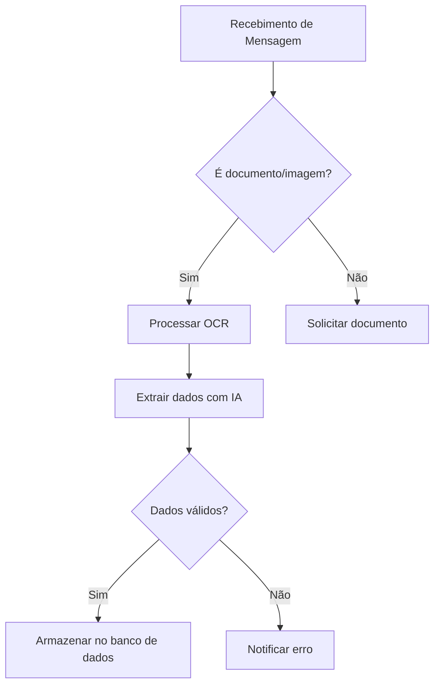

# 🚀 Talys Matheus - Analista de TI & Especialista em Automação

<div align="center">
  
</div>

## 🔍 Visão Profissional

```typescript
interface ProfessionalProfile {
  role: "Software Engineer";
  expertise: ["Backend Development", "Process Automation", "AI Integration"];
  currentFocus: "Building intelligent automation solutions with N8N";
  signatureProjects: ["ZyxChat", "WhatsApp Automation Suite", "NF-e Reader"];
  techStack: {
    languages: ["TypeScript", "Python", "PHP"];
    frameworks: ["React", "Next.js", "Flask"];
    automation: ["N8N", "LangChain", "Google Gemini"];
    databases: ["PostgreSQL", "MongoDB", "Google Sheets"];
  };
}
```

## 🛠️ Habilidades Técnicas Avançadas

### N8N & Automação


### Desenvolvimento Moderno


### Sistemas de Mensageria


## 🏆 Projetos Notáveis

### 🤖 ZyxChat - Plataforma de Chatbots
- **Stack:** TypeScript, React, N8N, Evolution API
- **Destaques:** 
  - Sistema de fluxos conversacionais avançados
  - Integração com múltiplos canais (WhatsApp, Telegram)
  - Painel administrativo com React e TypeScript

### 📄 Leitor Automático de NF-e
- **Stack:** N8N, Tesseract OCR, Google Gemini
- **Recursos:**
  - Extração automática de dados fiscais
  - Processamento de imagens via WhatsApp
  - Armazenamento em Google Sheets
  - Validação de chaves de acesso

### ⚡ Fluxos de Automação Empresarial
- **Tecnologias:** 
  - N8N workflows complexos
  - Integração Google Drive/Sheets
  - Processamento de documentos com IA
  - Comunicação automatizada via Outlook/WhatsApp

## 📈 Experiência em Automação



## 🎓 Educação Contínua

```python
class OngoingEducation:
    def __init__(self):
        self.current_focus = [
            "Advanced TypeScript Patterns",
            "Microservices Architecture",
            "AI-Powered Automation"
        ]
        
    def certifications(self):
        return {
            "n8n": "Advanced Workflow Design",
            "google_cloud": "AI/ML Specialization",
            "react": "TypeScript Best Practices"
        }
```

## 🌐 Conecte-se Comigo

<div align="center">

[](https://www.linkedin.com/in/talys-matheus-c-silva-b04aa42a7/)
[](mailto:talysmatheus12@gmail.com)
[](https://wa.me/5564999727955)

</div>

---

<div align="center">
  
</div>

